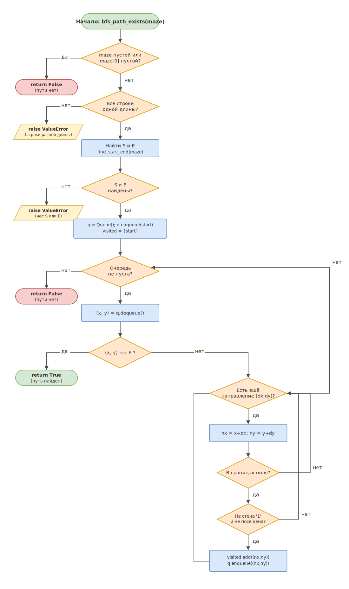

# lab_4_1

## Автор
ФИО: _________________
Группа: _________________

## Описание варианта
**Вариант 19. Очередь.**
Проверка пути в лабиринте (волновой алгоритм / BFS — упрощённый вариант).

Дан лабиринт — прямоугольная сетка из символов:
- `0` — проход;
- `1` — стена;
- `S` — старт;
- `E` — финиш.

Нужно определить, **существует ли** путь из `S` в `E`, перемещаясь по
свободным клеткам в четырёх направлениях (вверх, вниз, влево, вправо).
Используется обход в ширину (BFS) на базе **очереди (FIFO)**.

## Описание реализации

### Модуль `src/my_stack.py` — класс `Queue`
Очередь реализована «с нуля» на обычном списке Python (без
`collections.deque`). Принцип работы — **FIFO** (первым вошёл, первым вышел).

| Метод | Назначение | Сложность |
|-------|------------|-----------|
| `enqueue(item)` | добавить элемент в конец | O(1) |
| `dequeue()` | удалить и вернуть элемент из начала | O(n)* |
| `peek()` | посмотреть первый элемент без удаления | O(1) |
| `is_empty()` | проверка на пустоту | O(1) |
| `size()` | количество элементов | O(1) |

\* `dequeue` использует `list.pop(0)`, что в обычном списке Python
требует сдвига всех элементов — O(n). В кольцевом буфере или связном
списке эту операцию можно сделать за O(1).

**Обработка граничных случаев:** `dequeue()` и `peek()` на пустой очереди
возбуждают `IndexError`.

### Модуль `src/main.py` — решение задачи
- `find_start_end(maze)` — находит координаты `S` и `E`; если одного из них
  нет, возбуждает `ValueError`.
- `bfs_path_exists(maze)` — волновой алгоритм (BFS) на очереди. Возвращает
  `True`, если путь из `S` в `E` существует, иначе `False`.

**Идея алгоритма (BFS):** старт помещается в очередь и в множество
посещённых. Пока очередь не пуста, из её начала извлекается клетка; если
это финиш — путь существует (`True`). Иначе для каждого из четырёх соседей
проверяется, что он в границах поля, не является стеной и ещё не посещён, —
тогда сосед помечается посещённым и добавляется в конец очереди. Множество
`visited` гарантирует, что каждая клетка обрабатывается один раз. Если
очередь опустела, а финиш не достигнут — пути нет (`False`).

**Сложность алгоритма:** O(R × C), где R и C — число строк и столбцов
лабиринта (каждая клетка посещается не более одного раза).

**Обработка граничных случаев:**
- пустой лабиринт (`[]` или `[[]]`) → `False` (путь не существует);
- строки разной длины → `ValueError`;
- отсутствие `S` или `E` → `ValueError`.

## Блок-схема
Блок-схема метода `bfs_path_exists` (циклы, ветвления, проверки граничных
условий, выходы):



## Инструкция по запуску
Требуется Python 3.10+.

```bash
cd src
python main.py
```

Ожидаемый вывод для примера в `main.py`:
```
Путь из S в E существует.
```

## Ссылка на репозиторий
_Вставьте сюда ссылку на публичный репозиторий (GitHub / GitVerse)._
